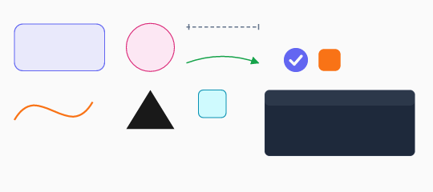
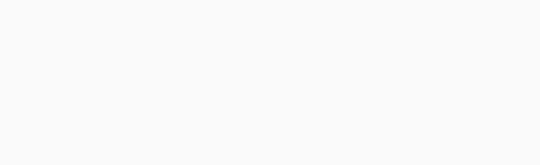
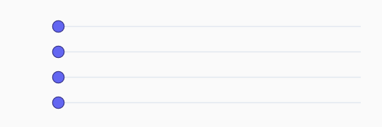
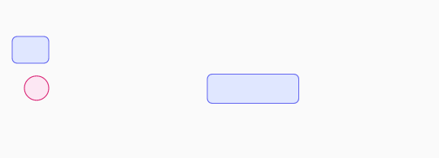
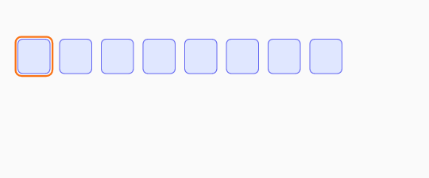
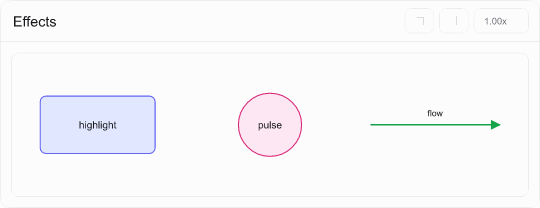
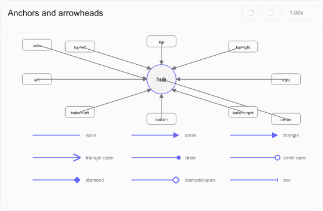
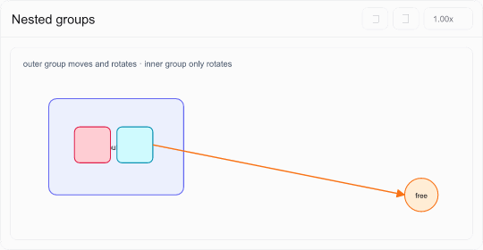

# @kokoa/clotho

JSON으로 정의하는 시각화 애니메이션 패키지.

애니메이션을 명령형 코드가 아닌 **선언적 JSON 문서**로 작성한다. 화면 상태는 `(문서, 시각 t)`만으로 결정되므로 원하는 시점으로 이동하거나, 정지 화면을 만들거나, 서버에서 결과를 출력하거나, 에디터에서 재생 위치를 옮길 때 모두 같은 코드가 동작한다. 이전 상태를 누적하지 않기 때문에 시간이 지나면서 화면이 어긋나는 문제도 생기지 않는다.

렌더링 결과는 특정 framework에 종속되지 않는 **scene graph**로 만든다. 각 adapter는 이 결과를 React element, Vue vnode, DOM, SVG 문자열로 옮기기만 하므로 실제 렌더링 규칙은 한 곳에서 관리된다.

## 애니메이션 갤러리

각 예시는 독립된 문서이며 아래 GIF도 라이브러리의 `writeDocumentGif`로 생성했다.

| 요소와 전이 | 이징과 보간 |
| --- | --- |
|  |  |
|  |  |
| 반복 패턴과 효과 | 연결과 그룹 |
|  |  |
|  |  |
| 챕터 |  |
|  |  |

```jsonc
{
  "clothoVersion": 1,
  "id": "bellman-ford",
  "title": "벨만-포드",
  "duration": 12000,
  "canvas": { "width": 800, "height": 460, "background": "transparent" },
  "elements": [
    {
      "type": "circle",
      "id": "n-a",
      "cx": 150,
      "cy": 230,
      "r": 32,
      "fill": "#fef3c7",
      "label": "A",
      "appearances": [{ "start": 0, "end": 12000 }],
      "tracks": [
        {
          "property": "fill",
          "keyframes": [
            { "time": 0, "value": "#fef3c7" },
            { "time": 2000, "value": "#dcfce7" },
          ],
        },
      ],
    },
  ],
  "chapters": [{ "id": "c1", "time": 2000, "label": "Round 1" }],
  "effects": [{ "type": "pulse", "id": "p1", "elementId": "n-a", "time": 2000 }],
}
```

## 설치

```bash
npm install @kokoa/clotho
yarn add @kokoa/clotho
pnpm add @kokoa/clotho
bun add @kokoa/clotho
```

React와 Vue는 선택 사항이므로 사용하는 framework만 설치하면 된다. 바닐라 JavaScript와 SVG 출력에는 추가 peer dependency가 필요하지 않다.

## 사용

### React

```tsx
import { parseDocumentOrThrow } from '@kokoa/clotho';
import { AnimationPlayer } from '@kokoa/clotho/react';
import '@kokoa/clotho/styles.css';

const doc = parseDocumentOrThrow(await (await fetch('/animations/bellman-ford.json')).json());

<AnimationPlayer doc={doc} />;
```

### Vue 3

```vue
<script setup lang="ts">
import { AnimationPlayer } from '@kokoa/clotho/vue';
import '@kokoa/clotho/styles.css';
const props = defineProps<{ doc: AnimationDocument }>();
</script>

<template><AnimationPlayer :doc="doc" /></template>
```

### 바닐라 JS

```ts
import { parseDocumentOrThrow } from '@kokoa/clotho';
import { mountPlayer } from '@kokoa/clotho/dom';
import '@kokoa/clotho/styles.css';

const handle = mountPlayer(document.querySelector('#stage')!, doc);
handle.player.seek(3000);
handle.destroy();
```

### 정적 SVG (SSR·썸네일·정적 내보내기)

```ts
import { renderDocumentToSvg } from '@kokoa/clotho/svg';

const svg = renderDocumentToSvg(doc, 6000, { standalone: true });
```

DOM도 프레임워크도 필요 없다. 프레임 단위로 호출하면 그대로 정지 프레임 시퀀스가 된다.

### 애니메이션 GIF 내보내기

```ts
import { writeDocumentGif } from '@kokoa/clotho/gif';

await writeDocumentGif(doc, 'knapsack.gif', {
  fps: 12,
  width: 800,
  background: '#ffffff',
  layout: 'player', // 제목, 조작 버튼, 현재 단계 설명, 전체 단계 목록까지 포함한다. 기본값이다.
});
```

애니메이션 영역만 필요하면 `layout: 'stage'`를 지정한다. 기본 renderer는 운영체제의 글꼴을 불러와 문자를 빠짐없이 그린다. CI처럼 실행 환경이 달라도 같은 결과가 필요하다면 `fontFiles: ['/path/font.ttf']`로 사용할 글꼴을 직접 지정할 수 있다. CSS 색상 token은 `theme: 'light' | 'dark'`에서 선택한 테마의 실제 색상으로 변환한다.

CLI에서도 같은 렌더 경로를 쓴다.

```bash
clotho gif animations/knapsack.json knapsack.gif --fps 12 --width 800
```

### 코드 기반 저작 헬퍼

작성 도우미는 별도의 실행 형식을 만들지 않는다. type을 검사하고 반복 표현을 실제 항목으로 펼친 뒤 에디터와 CLI가 그대로 읽을 수 있는 v1 JSON data를 반환한다.

```ts
import { appear, defineAnimation, effects, repeatAppearances, stagger, track } from '@kokoa/clotho';

const doc = defineAnimation({
  clothoVersion: 1,
  id: 'queue',
  duration: 3000,
  elements: [
    {
      type: 'circle',
      id: 'item',
      cx: 40,
      cy: 80,
      r: 16,
      appearances: repeatAppearances({ count: 3, duration: 600, gap: 200 }),
      tracks: [
        track('cx', [
          { time: 0, value: 40 },
          { time: 3000, value: 600, ease: 'easeOut' },
        ]),
      ],
    },
  ],
  effects: stagger(['item'], 150, (elementId, time, index) =>
    effects.pulse({ id: `pulse-${index}`, elementId, time }),
  ),
});
```

## 진입점

| 진입점 | 내용 | peer | gzip |
| --- | --- | --- | --: |
| `@kokoa/clotho` | 스키마·런타임·씬 그래프·재생 컨트롤러·검증·마이그레이션 | 없음 | 25KB |
| `…/svg` | SVG 문자열 직렬화 | 없음 | 16KB |
| `…/dom` | 바닐라 JS 어댑터 + 브라우저 스케줄러 | 없음 | 20KB |
| `…/react` | React 어댑터 + 컴포넌트·훅 | react, react-dom | 20KB |
| `…/vue` | Vue 3 어댑터 + 컴포넌트 | vue | 20KB |
| `…/node` | 파일시스템 문서 로더 | 없음 | 별도 진입점 |
| `…/gif` | Node/Bun용 애니메이션 GIF 렌더러 | 없음 | 별도 진입점 |
| `…/styles.css` | 스타일시트 | 없음 | 4KB |
| `…/schema.json` | v1 JSON Schema (에디터 자동완성용) | — | — |

렌더 어댑터는 이미 파싱된 문서를 받으므로 **zod를 포함하지 않는다.** 렌더만 하는 소비처는 검증기 비용을 내지 않고, 이 성질은 `bun run check:size`로 강제된다.

## CLI

```bash
clotho validate animations/            # 스키마 + 의미 검증
clotho validate animations/ --strict   # 경고도 실패로
clotho migrate  animations/ --write    # legacy v3/v4 → v1 변환
clotho gif animations/a.json a.gif --fps 12 --width 800
```

검증기는 스키마가 잡지 못하는 것들을 본다: 중복 id, 참조 무결성, 시간 범위, `parentId` 순환, 미해결 에셋, 그리고 **스키마에 없는 속성**. 마지막 항목이 특히 쓸모 있다 — 파서는 미지의 키를 조용히 버리므로, 작성자가 `line.label`(라벨은 `arrow`에만 있다)이나 `arrow.arrowEnd`(필드명은 `headEnd`)를 써도 아무 일도 일어나지 않는다. 이 패키지를 추출한 383개 실문서에는 그런 속성이 367개 있었다.

## 핵심 API

```ts
// 파싱 — 실패 시 예외 대신 이슈 목록을 반환값에 담는다
const result = parseDocument(json);
if (!result.ok) console.error(result.issues);

// 한 시점의 시각 상태 (순수)
const snapshot = computeSnapshot(doc, 3000);

// 한 시점의 렌더 데이터 (순수, 프레임워크 무관)
const scene = buildScene(doc, 3000, { assetResolver, highlighter });

// 재생 — 프레임워크 밖에 있다
const player = createPlayer(doc, { scheduler: animationFrameScheduler });
player.subscribe((state) => console.log(state.time, state.chapterIndex));
player.play();
player.seek(5000);
player.setSpeed(1.5);
player.destroy();

// 검증 / 마이그레이션
const { ok, findings } = validateDocument(json);
const { document, notes } = migrateLegacyDocument(legacyJson);
```

### 호스트 훅

패키지가 결정하지 않고 소비처가 주입하는 것들:

```ts
buildScene(doc, t, {
  assetResolver: { resolve: (ref) => myCdn.urlFor(ref.key) }, // ref 에셋 해석
  highlighter: myShikiHighlighter, // 코드 하이라이팅
  measurer: { measure: (text, size) => canvasMeasure(text, size) }, // 실측 폰트 메트릭
  fontFamily: '"My Sans", sans-serif',
});
```

이미지는 문서에 base64로 담거나(`inline`), URL로 두거나(`external`), 호스트가 해석하는 키로 둘 수 있다(`ref`). 에디터의 "이미지 첨부"는 `encodeImageAsset(bytes, mime)`으로 만든다.

### 테마

스타일시트는 `--cloth-*` 토큰에 라이트·다크 기본값을 모두 담고 있어 설정 없이 동작한다. 플레이어별로 `theme="light" | "dark" | "auto"`를 지정할 수 있고, DOM 어댑터도 같은 `theme` 옵션을 받는다.

```tsx
<AnimationPlayer doc={doc} theme="dark" />
```

자기 팔레트를 쓰려면 테마별 토큰을 매핑한다:

```css
[data-cloth-theme='light'] {
  --cloth-fg: var(--light-fg);
  --cloth-surface: var(--light-surface);
  --cloth-accent: var(--light-brand);
}

[data-cloth-theme='dark'] {
  --cloth-fg: var(--dark-fg);
  --cloth-surface: var(--dark-surface);
  --cloth-accent: var(--dark-brand);
}

/* auto 모드의 기본 토큰도 필요하면 :root에서 바꾼다. */
:root {
  --cloth-fg: var(--color-fg);
  --cloth-accent: var(--brand-500);
}
```

테마는 기본적으로 `prefers-color-scheme`을 따르고, 어느 조상에든 `data-cloth-theme`을 두면 그것이 이긴다.

### 챕터 목록 위치

`showChapterList`가 켜져 있고 실제 챕터가 있을 때만 목록이 보인다. 위치는 문서에서 좌·우·상·하로 지정하며 기본값은 기존 사이드바와 같은 `right`다.

```json
{
  "settings": {
    "showCaption": true,
    "showChapterList": true,
    "chapterListPosition": "right"
  }
}
```

### i18n

UI 문자열 기본값은 영어이며 부분 오버라이드가 가능하다. 한국어 문구는 `koreanStrings`로 제공한다.

```tsx
<AnimationPlayer doc={doc} strings={{ play: '재생', pause: '일시정지' }} />
```

## 문서 포맷

애니메이션을 직접 쓰려면 [`docs/AUTHORING.md`](./docs/AUTHORING.md)부터 읽는다. 필드별 정의는 [`docs/SCHEMA-V1.md`](./docs/SCHEMA-V1.md)에 있다.

요소 10종 (`rect · circle · line · arrow · text · image · path · polygon · group · code`), 등장 구간(`appearances`)과 속성 트랙(`tracks`)으로 이루어진 타임라인, 이펙트 3종 (`highlight · pulse · flow`), 챕터.

legacy v3/v4 문서는 런타임이 직접 받지 않는다. `clotho migrate`를 통과해야 한다.

## 예제

```bash
bun run gallery     # 기능별 문서 9개 — 요소 10종, 전이 8종, 이징 4종, 반복 패턴
```

각 문서에 "무엇을 볼 것인가"가 붙어 있고, **frames** 버튼이 타임라인 전체를 한 번에 펼친다. [`examples/README.md`](./examples/README.md) 참고.

## 문서

- [`docs/AUTHORING.md`](./docs/AUTHORING.md) — **애니메이션 저작 공식 문서**
- [`docs/SCHEMA-V1.md`](./docs/SCHEMA-V1.md) — v1 문서 포맷 명세
- [`docs/ARCHITECTURE.md`](./docs/ARCHITECTURE.md) — 씬 그래프, 어댑터, 재생 컨트롤러
- [`docs/RESEARCH.md`](./docs/RESEARCH.md) — 기존 두 구현체 실측 조사
- [`docs/MIGRATION.md`](./docs/MIGRATION.md) — legacy 문서·코드 이전
- [`docs/AUDIT-EDITOR.md`](./docs/AUDIT-EDITOR.md) — 에디터 기능 커버리지 감사
- [`docs/PROPOSALS.md`](./docs/PROPOSALS.md) — 확장 기획안 14건
- [`docs/RELEASING.md`](./docs/RELEASING.md) — 배포 전 검증·npm 업로드·설치 확인
- [`TASKS.md`](./TASKS.md) — 작업 계획과 진행 상황

에디터는 별도 패키지 `clotho-editor`로 분리된다.

## 개발

```bash
bun install
bun test                       # 유닛 + 코퍼스 회귀 + 어댑터 동등성
bun run typecheck
bun run lint
bun run build

bun run check:core-purity      # 코어에 프레임워크·DOM 의존 유입 차단
bun run check:styles           # 클래스·토큰·테마 경로 일치
bun run check:size             # 진입점별 크기 예산 + 서브패스 격리
bun run schema:check           # JSON Schema가 zod와 동기인지
bun run release:check          # 패키지 메타데이터와 tarball 내용 검사
bash scripts/verify-package-managers.sh # npm/yarn/bun 로컬 설치 검사
```

`.private/`에 참조 저장소가 있을 때만 도는 검사:

```bash
bun run check:legacy-equivalence   # legacy 엔진과 렌더 동등성 (383개 × 27,690 프레임)
bun run check:svg-wellformed       # 1,915 프레임을 실제 XML 파서로 검증
```

회귀 테스트는 실제 애니메이션 문서 383개를 픽스처로 쓴다. 저장소에 포함되지 않으므로 없으면 자동으로 건너뛴다. 위치는 `CLOTHO_CORPUS_DIR`로 지정한다.

## 라이선스

MIT
